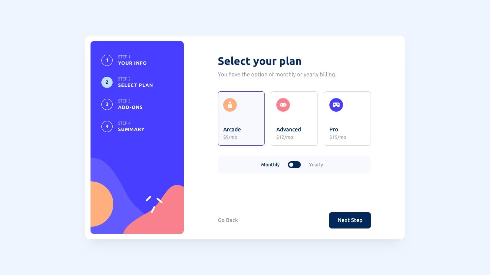

# Multi Step Form

This is a solution to the Multi-step form challenge on [Frontend Mentor](https://www.frontendmentor.io/challenges/multistep-form-YVAnSdqQBJ).

## Table of contents

- [Overview](#overview)
  - [The challenge](#the-challenge)
  - [Screenshot](#screenshot)
  - [Links](#links)
- [My process](#my-process)
  - [Built with](#built-with)
  - [What I learned](#what-i-learned)
- [Author](#author)

## Overview

### The challenge

Users should be able to:

- Complete each step of the sequence
- Go back to a previous step to update their selections
- See a summary of their selections on the final step and confirm their order
- View the optimal layout for the interface depending on their device's screen size
- See hover and focus states for all interactive elements on the page
- Receive form validation messages if:
  - A field has been missed
  - The email address is not formatted correctly
  - A step is submitted, but no selection has been made

### Screenshot





### Links

- Solution URL: [codewithstephen.com/multistepform](https://github.com/DemoStephen/09-starting-project-Multi-Step-Form-)
- Live Site URL: [codewithstephen.com/multistepform](https://github.io/09-starting-project(multi-step-form))

## My process

### Built with

- [Vite React](https://vite.dev/) - JS library
- CSS

### What I learned

```jsx
import "./App.css";
import Form from "./src/components/Form";
import SideBar from ".src/components/Sidebar";
import ThankYou from ".src/components/ThankYou";
export default function App() {
  return (
    <>
      <main className="d-flex">
        <SideBar />
        <section className="section">
          <Form />
          <ThankYou />
        </section>
      </main>
    </>
  );
}
```

## Author

- Website - [codewithstephen.com](https://www.codewithstephen.com)
- Frontend Mentor - [@codewithstephen](https://www.frontendmentor.io/profile/codewithstephen)
- Twitter - [@codewithstephen](https://www.twitter.com/codewithstephen)
